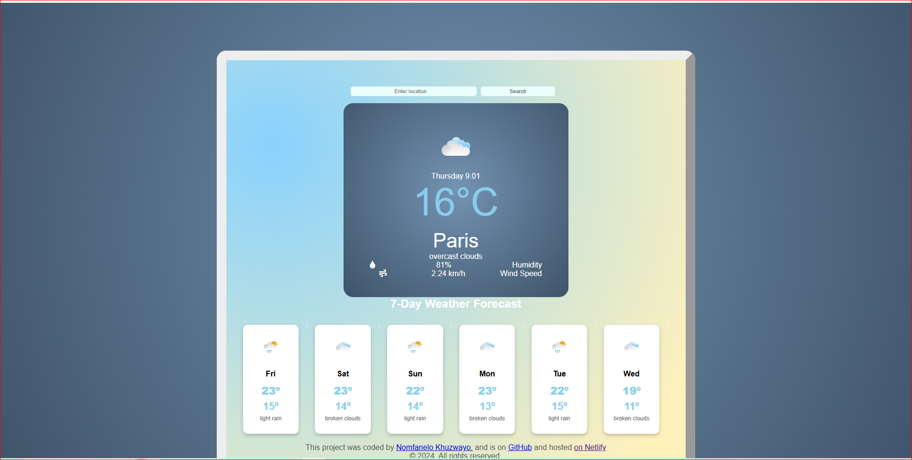

# ⛅ Weather Today App

A responsive weather application that allows users to search for any location and view current weather conditions along with a 7-day forecast. Built with **HTML, CSS, JavaScript**, and powered by **Axios** for API requests.

---

## ✨ Features
- Search for weather by city/location.  
- Displays **current temperature, humidity, wind speed, and weather description**.  
- Shows **weather icons** for conditions (sunny, cloudy, rainy, etc.).  
- Provides a **7-day forecast** with daily weather details.  
- Responsive design for desktop and mobile devices.  
- Clean UI with icons from **Font Awesome**.  

---

## 🛠️ Technologies Used
- **HTML5** – structure and semantic layout  
- **CSS3** – styling and responsive design  
- **JavaScript (ES6)** – dynamic functionality  
- **Axios** – API requests  
- **Font Awesome** – icons  
- **Netlify** – deployment and hosting  

---

## 🚀 Deployment
The project is live and hosted on **Netlify**:  
👉 [Weather Today App](https://my-weather-app10.netlify.app/)

Source code is available on GitHub:  
👉 [GitHub Repository](https://github.com/NO-MM/my-weather.app)

---

## 📂 Project Structure

Weather-Today-App/
│
├── index.html          # Main HTML file
├── src/
│   ├── style.css       # Stylesheet
│   ├── java.js         # Core functionality
│   └── screenshot.png  # Screenshot image
└── README.md           # Project documentation

---

## 👩‍💻 Author
This project was coded by **Nomfanelo Khuzwayo**.  
- GitHub: [NO-MM](https://github.com/NO-MM)  
- Hosted on: [Netlify](https://my-weather-app10.netlify.app/)  

---

## 📌 Future Improvements
- Add support for **geolocation** to automatically detect user’s current city.  
- Include **hourly forecast** in addition to the 7-day forecast.  
- Add **dark/light mode toggle**.  
- Improve error handling for invalid city searches.  

